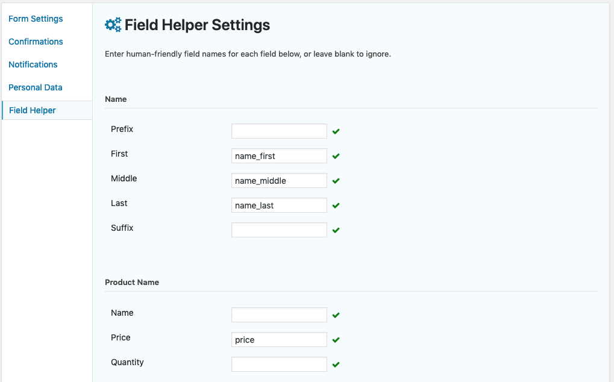

# Gravity Forms Field Helper

Adds a new REST API endpoint to retrieve friendly field names.

## Usage

1. Install and activate this plugin.
2. Create friendly field names on the form settings page: 
3. Use the API endpoint `https://your-site.com/wp-json/gf/v2/entries/json/` to retrieve entries. To retrieve a specific entry, add the entry ID to the end of the URL (e.g., `https://your-site.com/wp-json/gf/v2/entries/json/2`).
