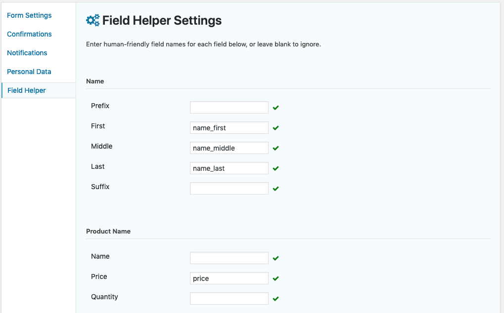

# Gravity Forms Field Helper

Adds a settings page and REST API endpoint to retrieve human- and computer-friendly field names.

## Usage

1. Install and activate this plugin.
2. Go to Forms > Settings > Field Helper to add your license key.
3. Create friendly field names on the form settings page:
   - 
4. Use the API endpoints to retrieve entries.
   - The standard entry data is untouched.
   - All named fields are added to a `fields` object in each entry object.

## API Endpoints

- Basically, append `/json` to Gravity Forms’ form- or entry-related endpoints to get JSON field data.
- Retrieve all entries:  `https://your-site.com/wp-json/gf/v2/entries/json/`
- Retrieve a specific entry:  `https://your-site.com/wp-json/gf/v2/entries/<entry_id>/json/`
- Retrieve all entries from a specific form:  `https://your-site.com/wp-json/gf/v2/forms/<form_id>/json/`
- Retrieve a specific entry from a specific form:  `https://your-site.com/wp-json/gf/v2/forms/<form_id>/entries/<entry_id>/json/`

## Examples

Example of a **standard** `entry/<ID>` response with ID fields:

```json
{
  "id": "2",
  "form_id": "1",
  "post_id": null,
  "date_created": "2019-03-04 15:52:49",
  "date_updated": "2019-03-04 15:52:49",
  "is_starred": "0",
  "is_read": "0",
  "ip": "127.0.0.1",
  "source_url": "https:\/\/wordpress.test\/?gf_page=preview&id=1",
  "user_agent": "<user-agent>",
  "currency": "USD",
  "payment_status": null,
  "payment_date": null,
  "payment_amount": null,
  "payment_method": null,
  "transaction_id": null,
  "is_fulfilled": null,
  "created_by": "1",
  "transaction_type": null,
  "status": "active",
  "1.3": "Jane",
  "1.6": "Doe",
  "3": "Tea",
  "4.1": "Bagel",
  "4.3": "Danish",
  "1.2": "",
  "1.4": "",
  "1.8": "",
  "2.1": "",
  "2.2": "",
  "2.3": "",
  "2.4": "",
  "2.5": "",
  "2.6": "",
  "4.2": ""
}
```

Example of a **friendly** `entry/<ID>` response with the `fields` object:

```json
{
  "id": "2",
  "form_id": "1",
  "post_id": null,
  "date_created": "2019-03-04 15:52:49",
  "date_updated": "2019-03-04 15:52:49",
  "is_starred": "0",
  "is_read": "0",
  "ip": "127.0.0.1",
  "source_url": "https:\/\/wordpress.test\/?gf_page=preview&id=1",
  "user_agent": "<user-agent>",
  "currency": "USD",
  "payment_status": null,
  "payment_date": null,
  "payment_amount": null,
  "payment_method": null,
  "transaction_id": null,
  "is_fulfilled": null,
  "created_by": "1",
  "transaction_type": null,
  "status": "active",
  "fields": {
    "name_first": "Jane",
    "name_last": "Doe",
    "beverage": "Tea",
    "name_middle": "",
    "address_1": "",
    "address_2": "",
    "city": "",
    "state": "",
    "zip": "",
    "country": ""
  }
}
```

## Changelog

See [change_log.txt](change_log.txt).
